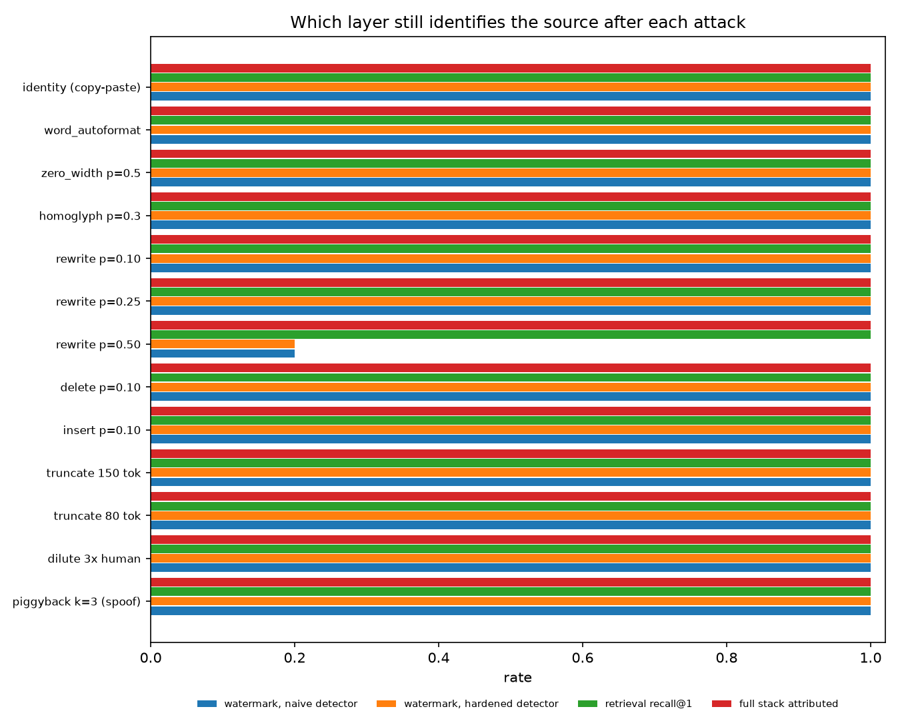
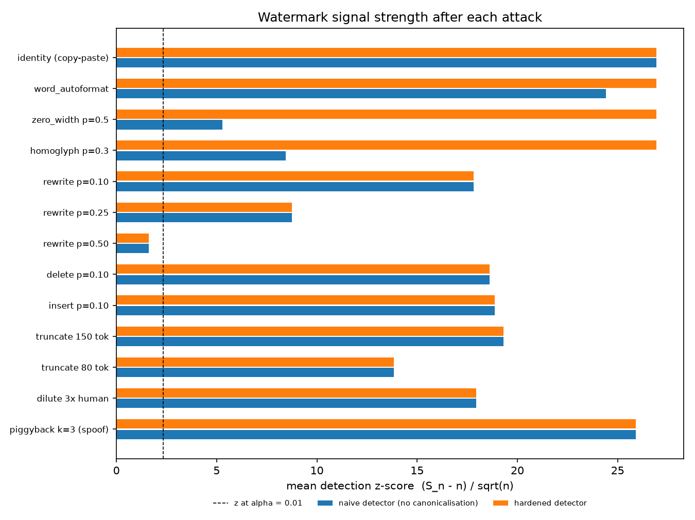

# Watermark — a reference defense stack for LLM text provenance

A one-command, self-validating reference implementation of

1. a **textGrain-style watermark** (keyed vocabulary blocks + entropy-budgeted
   optimal-transport coupling, the scheme OpenAI described on 5 October 2026 for
   EU AI Act Article 50 compliance),
2. a **hardened detector** (canonicalisation against tokenizer-desync attacks,
   Gamma-calibrated p-values, sliding-window segment localisation against dilution),
3. a **semantic retrieval index** (FAISS, multilingual sentence embeddings) — the layer
   that survives paraphrase and translation,
4. a **signed-output registry** (Ed25519 over canonical hashes, SQLite) — the layer
   that turns "watermark present" into "this exact text / this text minus these edits",
5. an **attack harness** that runs every attack through every layer and reports which
   layer still identifies the source.

```
                 generate ──► textGrain sampler ──► text ──► register (hash+sign) ──► registry.sqlite
                                     │                           └─► embed sentences ──► FAISS index
                                     ▼
   attacks: copy-paste · autoformat · zero-width · homoglyph · rewrite · delete · insert
            truncate · dilute · piggyback spoof · [hf] paraphrase · translate round-trip
                                     ▼
   verdicts: watermark p-value (naive vs hardened) · segment localisation
             retrieval recall@1 · registry exact / tampered (+diff) / unknown
```

## Run it

```bash
git clone https://github.com/yobiebenjamin/Watermark && cd Watermark
./run.sh                 # offline toy model, a few minutes on one CPU: venv, install, pytest, full sweep
./run.sh toy --quick     # smoke sweep, under a minute
```

Needs Python 3.10+ (the newest `python3.x` on `PATH` is picked automatically) and
network access to PyPI on first run. No model download, no GPU, no API key.

With a real model (GPU recommended; models download from Hugging Face on first run):

```bash
./run.sh hf --model Qwen/Qwen2.5-1.5B-Instruct \
            --embedder paraphrase-multilingual-MiniLM-L12-v2 \
            --llm-attacks --n 40 --tokens 400
```

`--llm-attacks` adds the two Tier-1 attacks that matter most: an unwatermarked
instruct model paraphrasing the output, and a French round-trip translation.

Every run writes `results/<backend>-<timestamp>/report.md`, `report.json`,
`roc.png`, `tpr.png`, `zscore.png`, plus the retrieval index, the registry database
and the signing key, so `textgrain-ref verify` can be pointed at it afterwards.

Individual commands:

```bash
KEY=$(textgrain-ref keygen)
textgrain-ref generate --key-hex $KEY --prompt "It was a truth universally acknowledged" --tokens 200 > wm.txt
textgrain-ref detect   --key-hex $KEY --file wm.txt            # {"p_value": ..., "z_score": ..., "detected": true}
textgrain-ref localize --key-hex $KEY --file long_document.txt # watermarked segments with character spans
textgrain-ref verify   --out results/toy-<timestamp> --file suspect.txt  # exact | tampered (+diff) | unknown (uses that run's index + registry)
```

## What the harness shows (toy backend, 30 × 300 tokens, α = 0.01, β = 0.5)

Full report: [`results/toy-beta0.5/report.md`](results/toy-beta0.5/report.md); a
weaker-signal run at β = 0.2 is in [`results/toy-beta0.2/report.md`](results/toy-beta0.2/report.md).

| attack | tokens changed | TPR naive | TPR hardened | mean z naive | mean z hardened | retrieval R@1 | registry exact / tampered / unknown | stack attributed |
|---|---|---|---|---|---|---|---|---|
| identity (copy-paste) | 0% | 100% | 100% | 26.9 | 26.9 | 100% | 100 / 0 / 0 | 100% |
| word_autoformat | 0% | 100% | 100% | 24.4 | 26.9 | 100% | 100 / 0 / 0 | 100% |
| zero_width p=0.5 | 0% | 100% | 100% | 5.3 | 26.9 | 100% | 100 / 0 / 0 | 100% |
| homoglyph p=0.3 | 0% | 100% | 100% | 8.4 | 26.9 | 100% | 100 / 0 / 0 | 100% |
| rewrite p=0.10 | 16% | 100% | 100% | 17.8 | 17.8 | 100% | 0 / 100 / 0 | 100% |
| rewrite p=0.25 | 34% | 100% | 100% | 8.7 | 8.7 | 100% | 0 / 100 / 0 | 100% |
| rewrite p=0.50 | 73% | 20% | 20% | 1.6 | 1.6 | 100% | 0 / 0 / 100 | 100% |
| delete p=0.10 | 15% | 100% | 100% | 18.6 | 18.6 | 100% | 0 / 100 / 0 | 100% |
| insert p=0.10 | 13% | 100% | 100% | 18.9 | 18.9 | 100% | 0 / 100 / 0 | 100% |
| truncate 150 tok | 50% | 100% | 100% | 19.3 | 19.3 | 100% | 0 / 100 / 0 | 100% |
| truncate 80 tok | 73% | 100% | 100% | 13.8 | 13.8 | 100% | 0 / 100 / 0 | 100% |
| dilute 3× human | 54% | 100% | 100% | 17.9 | 17.9 | 100% | 0 / 100 / 0 | 100% (localisation IoU 0.73, found 100%) |
| piggyback k=3 (spoof) | 1% | 100% | 100% | 25.9 | 25.9 | 100% | 0 / 100 / 0 | 100% |

Null calibration on 60 passages (30 human, 30 unwatermarked model): analytic FPR 1.7%
at α = 1%; registry says `unknown` for 100% of human text. Same prompt + same key gives
distinct outputs 100% of the time (Gumbel-max would give 0%). Achieved entropy budget
0.464 of a requested 0.5.




Read the table as the threat model:

* **Copy-paste is a non-event.** The signal is the word sequence; docx → vi → anything
  preserves it. Registry returns `exact`.
* **Tokenizer-desync attacks work against a naive detector** (z drops from 27 to 5–8
  with zero visible change) **and do nothing against the hardened one.**
* **Rewriting is the real attack.** Half the tokens resampled and the watermark is at
  chance; every edit costs `context_window + 1` scored positions, which is why the
  curve is steep. Only retrieval still finds the source.
* **Dilution hides the signal from the passage test** but not from localisation.
* **Piggyback spoofing beats the watermark** (a 3-token edit is still "detected") and
  is caught by the registry, which returns `tampered` with the differing spans.

The toy model has ~3.7 nats/token of entropy, two to three times a real instruct LLM,
so absolute rates are optimistic; the ordering and the layer behaviour transfer.
`bash results/reproduce.sh` regenerates both committed runs (seeded; identical up to
floating-point differences between machines).

Documentation:

* [`docs/NARRATIVE_PLAIN_ENGLISH.md`](docs/NARRATIVE_PLAIN_ENGLISH.md) — the whole project
  explained for a general reader: problem, purpose, method, results, impact.
* [`docs/NARRATIVE_TECHNICAL.md`](docs/NARRATIVE_TECHNICAL.md) — the same narrative with the
  mechanisms, numbers and limits spelled out.
* [`docs/DESIGN.md`](docs/DESIGN.md) — the mathematics of embedding, detection,
  hardening and the two extra layers, and what each test checks.
* [`docs/THREAT_MODEL.md`](docs/THREAT_MODEL.md) — attacks ranked by cost, who uses
  them, and which layer holds against each.
* [`docs/USAGE.md`](docs/USAGE.md) — CLI reference, Python API, Hugging Face backend,
  how to read the report, how to extend the harness.

## Repository layout

```
textgrain_ref/
  prf.py          keyed PRF: HMAC seeds, random-access partition / cost table / column
  ot.py           entropy-budgeted block OT (log-domain Sinkhorn, lambda calibration, marginal correction)
  watermark.py    TextGrainSampler, temperature/top-p, backend-agnostic generate()
  canonicalize.py NFKC + zero-width + confusables + typography normalisation
  detector.py     Gamma(n,1) test, p-values, empirical thresholds, sliding-window localisation
  retrieval.py    sentence splitting, hashing / sentence-transformers embedders, FAISS index
  registry.py     Ed25519-signed canonical-hash registry, exact / tampered / unknown verdicts, token diffs
  attacks.py      attack library and the default sweep
  harness.py      end-to-end evaluation, report.md / report.json / plots
  cli.py          demo · generate · detect · localize · verify · keygen
  lm/ngram.py     offline toy trigram LM (interpolated absolute discounting)
  lm/hf.py        Hugging Face backend with KV-cached watermarked decoding + instruct helpers
tests/test_stack.py   15 tests: PRF, OT marginals/budget, unbiasedness + entropy identity,
                      Exp(1) null (KS), FPR control, detection power, wrong key, diversity,
                      canonicalisation vs desync attacks, localisation, retrieval, registry, signatures
data/             public-domain Austen texts for the toy LM and the human-text pool (fetch_corpus.sh)
results/          committed reports and plots from the two reference runs (+ reproduce.sh)
docs/             NARRATIVE_PLAIN_ENGLISH.md, NARRATIVE_TECHNICAL.md, DESIGN.md, THREAT_MODEL.md, USAGE.md
```

## Production notes (what a reference implementation leaves out)

* **PRF.** Seeds come from HMAC-SHA256; per-element expansion uses splitmix64, a
  mixer, not a cipher. Replace with AES-CTR / ChaCha20 keyed by the HMAC output.
* **Keys.** The demo derives a deterministic key from `--seed` for reproducibility.
  Use `textgrain-ref keygen` (or an HSM), one key per model, version-tagged so
  rotation does not orphan old content.
* **Calibration.** The analytic null assumes independence across contexts; the report
  itself says a fixed deployed key needs empirical calibration per language and domain.
  The harness prints an empirical threshold from the null sample; with only 60 null
  passages that quantile is dominated by its single largest value, so use a large null
  set before trusting an operating point.
* **Oracles.** The detector, the retrieval query endpoint and the registry verifier
  are all oracles for adaptive attackers. Gate them, rate-limit per account, return
  calibrated verdict bands rather than raw scores.
* **Coverage.** Nothing here helps against text from models that were never
  watermarked, against deterministic decoding (temperature 0 leaves no entropy to
  tilt), or against low-entropy domains such as code; only retrieval covers those.
* **Privacy.** The retrieval index stores embeddings of every output. Salt, shard per
  tenant, bound retention, and treat it as personal data where applicable.

## References

* OpenAI, *textGrain: Entropy-Calibrated Watermarking for Language Model Text*,
  technical report, 5 October 2026.
* Aaronson (2023) Gumbel-max watermark; Kirchenbauer et al. (2023) green-list watermark;
  Dathathri et al. (2024) SynthID-Text; Kuditipudi et al. (2024) distortion-free watermarks.
* Christ, Gunn, Zamir (2024) undetectable watermarks; Christ & Gunn (2024) pseudorandom codes.
* Zhang et al. (2024) *Watermarks in the Sand* (impossibility of strong watermarking).
* Krishna et al. (2023) paraphrasing evades detectors, retrieval is an effective defense.
* Jovanović et al. (2024) watermark stealing; Pang et al. (2024) no free lunch in LLM watermarking.
* Altschuler, Niles-Weed, Rigollet (2017) Sinkhorn rounding; Cuturi (2013) Sinkhorn distances.

## Blog

Two posts on what this study found, in [`blog/`](blog/) as Markdown and Word (CC BY-NC 4.0, see License below):
[Why an Invisible Stamp Won't Keep AI Safe](blog/01-why-an-invisible-stamp-wont-keep-ai-safe.md) (for everyone) and
[Inside OpenAI's Watermark: What the Study Found](blog/02-inside-openais-watermark.md) (the deep technical companion, with the code). Where the argument goes from here is in [A Multi-Layer Approach to AI Safety](https://github.com/YobieBenjamin/hardware-and-silicon/blob/main/blog/01-a-multi-layer-approach-to-ai-safety.md).

## License

Source-available, not open source. Copyright (c) 2026 Yobie Benjamin. Software is licensed under the PolyForm Noncommercial License 1.0.0 ([LICENSE.md](https://github.com/YobieBenjamin/safety/blob/main/LICENSE.md)); documentation, data and figures under CC BY-NC 4.0 ([LICENSE-DOCS.txt](https://github.com/YobieBenjamin/safety/blob/main/LICENSE-DOCS.txt)). Attribution is required for any use in whole or in part ([NOTICE](https://github.com/YobieBenjamin/safety/blob/main/NOTICE)); commercial use requires a separate license. See [LICENSING.md](https://github.com/YobieBenjamin/safety/blob/main/LICENSING.md) for scope and contact, and [CITATION.cff](https://github.com/YobieBenjamin/safety/blob/main/CITATION.cff) to cite this work.
